  

  

<code>01 / about</code>

<table>
  <tr>
    <td width="58%">
      <strong>I like turning ideas into working software and learning by building them for real.</strong>
    </td>
    <td width="42%">
      <code>name</code>&nbsp;&nbsp;&nbsp;&nbsp;&nbsp; qiqiqisi 
      <code>major</code>&nbsp;&nbsp;&nbsp;&nbsp; Computer Science 
      <code>school</code>&nbsp;&nbsp;&nbsp; Ocean University of China 
      <code>focus</code>&nbsp;&nbsp;&nbsp;&nbsp; software · deep learning
    </td>
  </tr>
</table>

 

<code>02 / selected projects</code>

<table>
  <tr>
    <td width="50%">
      <a href="https://github.com/qiqiqisi/ouc-mobile-software-development"><strong>ouc-mobile-software-development ↗</strong></a>  
      Mobile software development course projects and experiments.  
      <code>WeChat Mini Program</code> · <code>HarmonyOS</code> · <code>Frontend</code>
    </td>
    <td width="50%">
      <a href="https://github.com/qiqiqisi/django-shopping-websites"><strong>django-shopping-websites ↗</strong></a>  
      A Django-based e-commerce web project.  
      <code>Django</code> · <code>Python</code> · <code>Web Development</code>
    </td>
  </tr>
  <tr>
    <td colspan="2">
      <a href="https://github.com/qiqiqisi/Latex_Used"><strong>Latex_Used ↗</strong></a>  
      Reusable LaTeX templates for experiment reports and academic writing.  
      <code>LaTeX</code> · <code>XeLaTeX</code> · <code>Academic Writing</code>
    </td>
  </tr>
</table>

  <code>keep building.</code>

